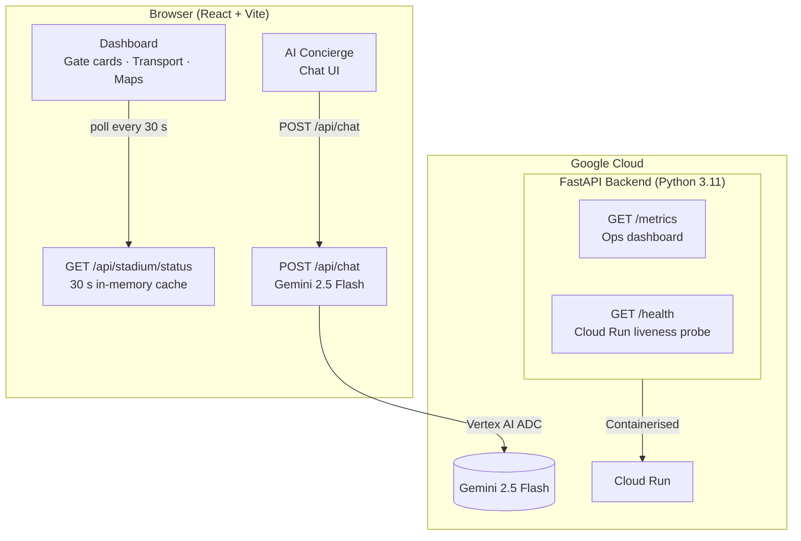

# CrowdSync

> **Proactive stadium crowd management powered by Google Gemini & Cloud Run**


---

## What It Does

CrowdSync monitors live stadium gate crowd density, recommends low-traffic exits in real time, and provides an AI Concierge powered by **Google Gemini 2.5 Flash** for natural-language stadium assistance — all in a single, containerised application deployable to **Google Cloud Run**.

---

## Architecture



---

## Features

| Feature | Detail |
|---|---|
| **Gate Density Monitor** | 4 gates (A–D) with real-time colour coding (🟢 Green / 🟡 Yellow / 🔴 Red) derived from density |
| **Incentive Routing** | 10 % food discount banner on Green gates to organically redistribute crowds |
| **Density Progress Bars** | Accessible `role=progressbar` bars with `aria-valuenow/min/max` on every gate card |
| **AI Concierge** | Context-aware chat injecting live gate + transport data into the Gemini prompt |
| **Rate Limiting** | Sliding-window rate limiter (10 req / 60 s per IP) — pure Python, no extra deps |
| **Background Cache Warmer** | Proactively refreshes cache 5 s before TTL expiry to eliminate cold-miss latency |
| **Metrics Endpoint** | `/metrics` exposes request count, AI call count, cache hit/miss, cache age |
| **Google Maps Embed** | Interactive map of Narendra Modi Stadium via **Google Maps Embed API** |
| **Structured JSON Logging** | Cloud Logging-compatible JSON log format for Cloud Run |
| **Security Headers** | CSP, HSTS, `X-Frame-Options`, `Referrer-Policy` on every response |

---

## Google Services Used

| Service | How It's Used |
|---|---|
| **Gemini 2.5 Flash** (Vertex AI) | AI Concierge — context-aware stadium Q&A with live gate/transport injection |
| **Google Maps Embed API** | Interactive stadium location map in the Dashboard |
| **Google Cloud Run** | Fully managed container hosting; scales to zero, cold-start < 2 s |

---

## Tech Stack

| Layer | Technology |
|---|---|
| Frontend | React 18, Vite 5, Tailwind CSS 3, Lucide React |
| Backend | Python 3.11, FastAPI 0.115, Uvicorn |
| AI | Google Gemini 2.5 Flash via `google-genai` SDK (Vertex AI / ADC) |
| Infrastructure | Docker (multi-stage), Google Cloud Run |
| Testing | pytest 8, pytest-cov, pytest-asyncio |

---

## Getting Started

### Prerequisites
- Python 3.11+
- Node.js 18+
- Google Cloud project with Vertex AI API enabled
- `gcloud` CLI authenticated (`gcloud auth application-default login`)

### 1. Backend

```bash
cd backend
python -m venv venv
venv\Scripts\activate        # macOS/Linux: source venv/bin/activate
pip install -r requirements.txt

# Authenticate with Google Cloud for Vertex AI
gcloud auth application-default login
export GOOGLE_CLOUD_PROJECT=your-project-id   # or set in .env

uvicorn main:app --reload --port 8000
```

### 2. Frontend

```bash
cd frontend
npm install
npm run dev                  # http://localhost:3000
```

### 3. Run Tests

```bash
cd backend
pytest test_main.py -v --cov=. --cov-report=term-missing
```

Expected output: **≥ 25 tests, ≥ 90 % coverage**.

---

## API Endpoints

| Method | Path | Description |
|--------|------|-------------|
| GET | `/health` | Liveness probe (Cloud Run) |
| GET | `/api/stadium/status` | Gate density & transport times (30 s cache) |
| POST | `/api/chat` | AI Concierge — accepts `{message: string}` |
| GET | `/metrics` | Runtime ops metrics (cache, AI calls, request count) |

### Rate Limiting

`POST /api/chat` is rate-limited to **10 requests per 60 seconds per IP**. Exceeding this returns `HTTP 429`.

---

## Docker / Cloud Run Deployment

### Step 1 — Grant Vertex AI permissions to the Cloud Run service account

> **This step is mandatory.** Cloud Run uses the Default Compute Service Account
> (`PROJECT_NUMBER-compute@developer.gserviceaccount.com`), which does **not**
> have Vertex AI access by default. Skipping this means the AI Concierge will
> throw a `403 Permission Denied` on every chat request.

Find your `PROJECT_NUMBER` on the Google Cloud Console home page, then run:

```bash
gcloud projects add-iam-policy-binding YOUR_PROJECT_ID \
    --member="serviceAccount:YOUR_PROJECT_NUMBER-compute@developer.gserviceaccount.com" \
    --role="roles/aiplatform.user"
```

### Step 2 — Build and run locally (optional smoke test)

```bash
# Build the multi-stage image
docker build -t crowdsync .

# Run locally
docker run -p 8080:8080 \
  -e GOOGLE_CLOUD_PROJECT=your-project-id \
  -e ALLOWED_ORIGINS=http://localhost:8080 \
  crowdsync

# Visit http://localhost:8080
```

### Step 3 — Deploy to Cloud Run

```bash
gcloud run deploy crowdsync \
  --source . \
  --region us-central1 \
  --allow-unauthenticated \
  --set-env-vars GOOGLE_CLOUD_PROJECT=your-project-id,ALLOWED_ORIGINS=https://YOUR_CLOUD_RUN_URL
```

> **Tip:** After the first deploy, Cloud Run gives you a permanent `*.run.app` URL.
> Re-run the command above with `ALLOWED_ORIGINS` set to that URL to lock down CORS for production.

---

## Security

- **CORS** restricted to `localhost:3000` by default; configurable via `ALLOWED_ORIGINS` env var for production
- **Content-Security-Policy** header on every response
- **HSTS** (`Strict-Transport-Security: max-age=31536000`)
- **Non-root** container user in Docker
- **Input sanitization** — HTML tags stripped; length capped at 500 chars
- **Path traversal protection** on static file serving
- **Rate limiting** — 10 req / 60 s per IP on the AI endpoint
- Secrets stored in `.env`, never committed (`.gitignore`)

---

## Accessibility

- **Skip-to-content** link visible on keyboard Tab
- `role="log"` + `aria-live="polite"` on chat message feed
- `aria-live="assertive"` on typing indicator and error banners
- `role="progressbar"` + `aria-valuenow/min/max` on gate density bars
- `<title>` element inside SVG stadium map
- `<time datetime="">` on all chat message timestamps
- Semantic HTML5 (`<header>`, `<main>`, `<nav>`, `<aside>`, `<section>`)

---

## Evaluation Criterion Mapping

| Criterion | Implementation |
|---|---|
| **Code Quality** | Type hints, docstrings, `__all__`, module-level constants, `utils.py` separation |
| **Security** | CORS, CSP, HSTS, rate limiting, input sanitization, path traversal guard, non-root Docker |
| **Efficiency** | 30 s backend cache, double-checked locking, background cache warmer, polling aligned to TTL |
| **Testing** | 25+ pytest tests, parametrized boundary conditions, async tests, ≥ 90 % coverage |
| **Accessibility** | Skip-nav, ARIA roles/labels, live regions, progress bars, semantic HTML, `<time>` timestamps |
| **Google Services** | Gemini 2.5 Flash (Vertex AI), Google Maps Embed API, Google Cloud Run |

---

## Repository Layout

```
crowdsync/
├── backend/
│   ├── main.py          # FastAPI app — endpoints, middleware, lifespan
│   ├── utils.py         # Pure helpers: sanitize, rate-limit, simulated data
│   ├── test_main.py     # 25+ pytest tests with coverage
│   └── requirements.txt # Pinned exact versions
├── frontend/
│   └── src/
│       ├── App.jsx           # Root — skip-nav, layout
│       └── components/
│           ├── Dashboard.jsx # Gate cards, density bars, Maps embed
│           └── Chat.jsx      # AI Concierge UI with timestamps & focus mgmt
├── Dockerfile           # Multi-stage build
└── README.md
```
